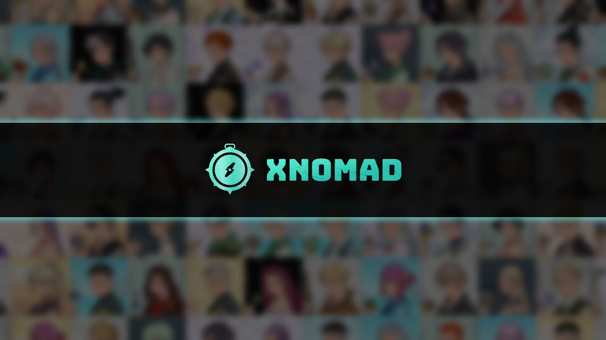

# Introduction

<figure><figcaption></figcaption></figure>

## What is AI-NFT?

AI-NFT is not just simply attaching an NFT image to an AI agent. **AI-NFT turns AI agents into real assets that are transferable, trackable, and capable of operating independently of clients.**

You can run the AI agent behind an AI-NFT in any environment with [Eliza](https://github.com/elizaOS/eliza) (a popular AI framework by AI16Z) installed, like in local, in the cloud, or in TEE, while keeping their performance consistent.

## Why we need AI-NFT

Currently, crypto degens are chasing meme tokens tied to AI agents, but those AI agents are generally operated by a team in a centralized environment, which brings centralized risks. Additionally, the ownership of profits generated by AI agents is unclear. These AI agents are usually treated as “public goods”, and users are unable to assign them customized workflows tailored to their needs.

If you could own your own AI agent and have it perform intelligent, automated tasks—such as on-chain trading, claiming airdrops, and transferring assets—exclusively with your permission, while also being the only one able to manage its assets and withdraw investment returns, it would significantly increase the adoption of AI agents among regular users, not just professional developers.

**So we introduced AI-NFT, which means deploying AI agents as NFTs on the blockchain.** NFT creates a wealth relationship between the AI agent and humans, turning the AI agent itself into a real asset with financial value. **You own AI-NFT, you own AI agents.**

## What is xNomad?

**xNomad** is a development dev kit that makes AI agents become NFTs (AI-NFT), cost-effectively creates various kinds of AI-NFT, and enables AI-NFT to interact seamlessly, securely and autonomously with dapps across multichains.&#x20;

Every AI-NFT has these exciting features:

* Based on [Eliza](https://github.com/elizaos/eliza) by [@ai16zdao](https://x.com/ai16zdao), each NFT is an independent AI agent with a unique configuration and personality.
* The AI agent runs in a secure TEE environment with their own crypto wallets, ensuring private keys remain untouchable.
* The AI agent can independently invest and trade crypto assets, with NFT owners able to withdraw the assets they hold. **The AI-NFT’s value will grow with its AI agent’s assets.**
* Each AI-NFT has a unique personality and communication style based on its traits.
* NFT owners can set customized on-chain workflow, like auto-trading, investment, claiming airdrop,  Defi-related actions, etc.
* The AI agent can also connect to social platforms like Telegram, Twitter bots and live stream.

## The benefits of owning an AI-NFT

1. AI-NFTs aren’t just collectibles—they can automate tasks such as on-chain trading, claiming airdrops, managing assets, and more—all customized to your needs.
2. All the asset gains and earnings from an AI-NFT can be claimed and managed by its owner.
3. AI-NFTs are transferable. The value of assets held by an AI-NFT is reflected in its own market value.
4. Fully decentralized AI agents ensure their functionality and assets are secure, with no risk of service providers disappearing.
5. More that you can imagine...

