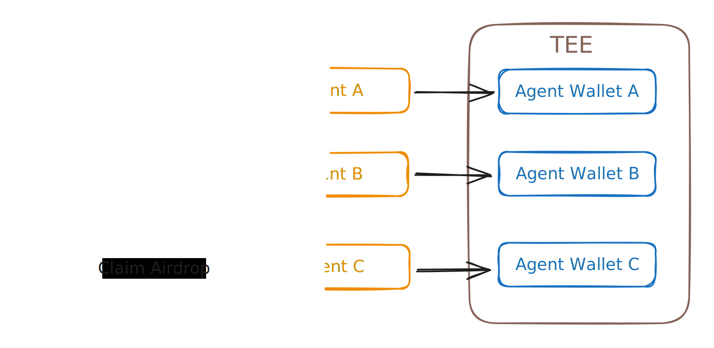

# Paano Gumagana ang AI-NFT?

Ipinapakita ng diagram na ito ang arkitektura at functionality ng AI-NFTs.

Ang pangunahing bahagi na kailangan ng AI-NFT:

* Isang pinalawig na NFT metadata na may character config file ng AI agent.
* Isang pangkaraniwang NFT contract.
* Isang runtime sa TEE na may Eliza na naka-install.

Sa ganitong paraan, magagamit ng AI-NFTs ang mga umiiral na frameworks at imprastruktura. Sa pamamagitan ng pag-embed ng character file JSON ng AI agent sa NFT metadata at pag-deploy nito sa blockchain, ang AI agent ay tuloy-tuloy na nagiging isang on-chain asset.

Ang simple ay pinakamahusay.

Para sa karagdagang detalye tungkol sa AI-NFT metadata, pakitingnan ang pahinang ito:


[ai-nft-metadata.md](ai-nft-metadata.md)

