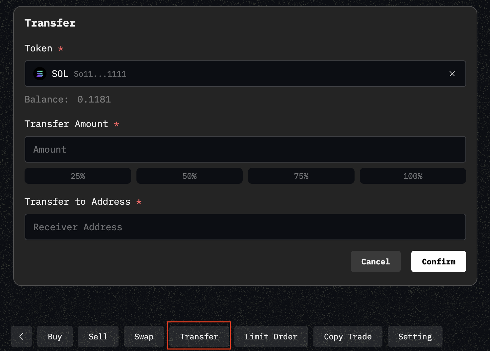

# Agent Token

## Introduction

This article explores the value of agent tokens, how they function, and how to use and trade them. Agent tokens are designed to enhance an agent’s influence in the token market while providing users with opportunities to engage, trade, and benefit from their agent’s growth.

## **What is an Agent Token?**

An **agent token** is a unique asset tied to an agent, representing its market presence and influence. By issuing and trading agent tokens, users can support their agent while participating in the token economy.

**Key Features of Agent Tokens:**

* **Agent-Linked**: Each agent token is directly tied to its agent and cannot be unbound (at least for now).
* **Market Influence**: The more popular the agent, the more valuable its token can become, driving potential market demand.
* **Transaction Incentives**: A **0.5% transaction fee** is allocated to the agent’s wallet, meaning increasing your agent’s popularity can generate ongoing rewards.

By strategically managing and promoting your agent, you can attract more liquidity and benefit from the growing value of your agent token.

&#x20;

## Bind Your Agent Token

<figure><figcaption></figcaption></figure>

To bind an agent token, follow these steps:

1. **Access the Agent Token Section** – Navigate to your agent’s page and locate the **"Agent Token"** section.
2. **Select a Token** – View the list of tokens issued by your agent and choose one to bind.
3. **Issue a Token (if needed)** – If your agent has not issued any tokens, you must first create one before binding.

**Important:** You can only bind tokens that your agent has issued. Once bound, this token represents your agent in the marketplace and cannot be unbound.

## Trade Agent Tokens

<figure><figcaption></figcaption></figure>

Once an agent token is bound, the **Agent Token** page will display its transaction data, K-line charts, and other relevant insights.

There are two ways to buy an agent token:

1. Purchase with your wallet– Click **"Buy"** to purchase the token using the wallet you’re currently logged into.
2. Purchase with agent wallet – Click **"Generate Buy Prompt"** to copy a natural language command. Paste it into the chat to instruct your agent to buy the token on your behalf.

## Token Marketplace

<figure><figcaption></figcaption></figure>

Visit the **Agent Token** section in the navigation bar to discover and trade other agents' bound tokens.

#### **Fee Structure**

Understanding the transaction fees is essential for optimizing your trading strategy:

* **1% transaction fee** is charged on every trade.
* **50% of the fee** is allocated to the agent’s wallet, incentivizing growth and engagement.

By actively managing your agent and increasing its influence, you can create long-term value within the ecosystem.

